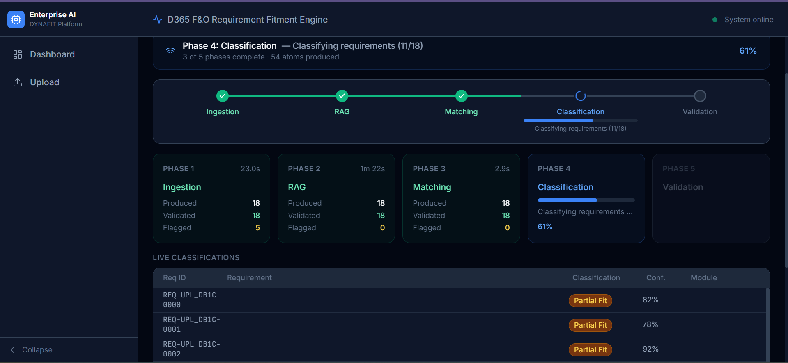
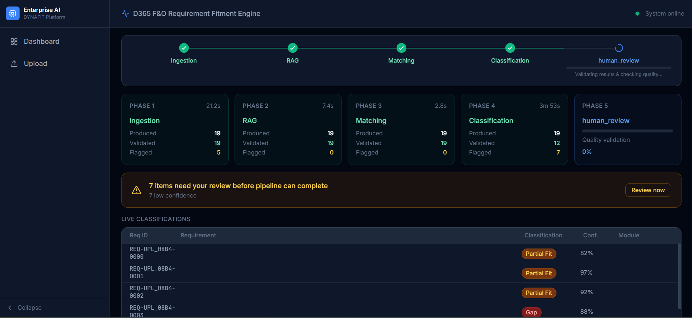
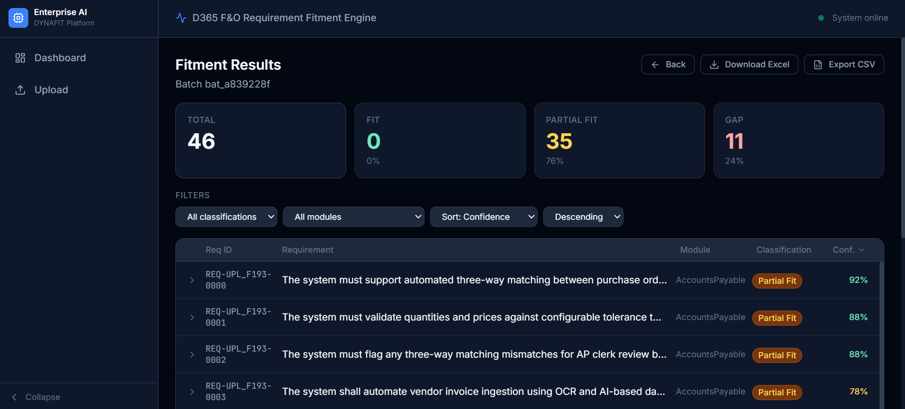
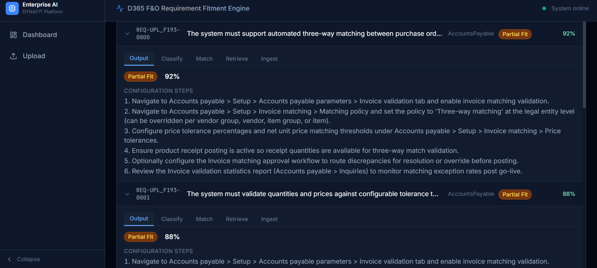
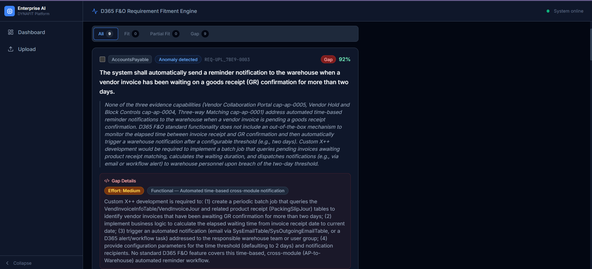

# Enterprise AI Platform

AI agent platform for automating ERP implementation workflows. **Module 1: REQFIT** — Requirement Fitment Engine for Microsoft D365 F&O — is complete across all 4 layers.

## What is REQFIT?

5-phase pipeline that converts D365 requirements into validated fitment recommendations with human review:
1. **Ingestion** — Parse requirements from PDF/DOCX/TXT
2. **RAG** — Retrieve matching D365 capabilities from MS Learn
3. **Matching** — Identify fitness gaps and alternatives
4. **Classification** — Categorize requirements (standard, customization, third-party)
5. **Validation** — Human-in-the-loop review, guardrails enforcement

See [system_architecture.mmd](docs/diagrams/pa_diagrams/system_architecture.mmd) | [langraph_pipeline.mmd](docs/diagrams/pa_diagrams/langraph_pipeline.mmd) | [hitl_flow.mmd](docs/diagrams/pa_diagrams/hitl_flow.mmd)

## Layered Architecture

```
api/                Layer 4 → FastAPI + Celery + WebSocket
modules/dynafit/    Layer 3 → REQFIT phases (Phase 1–5)
agents/             Layer 2 → Reusable LangGraph nodes
platform/           Layer 1 → LLM, retrieval, parsers, storage, observability
knowledge_bases/    Product data (YAML + JSONL only, no Python)
```

**Dependency rule:** `api → modules → agents → platform`. Never sideways. CI enforces on every PR.

---

## Screenshots

### Dashboard



### HITL, Validation



### Batch Results



### Fitment analysis



### Gap Analysis



---

## Stack

| Concern          | Technology                                                  |
| ---------------- | ----------------------------------------------------------- |
| Orchestration    | LangGraph (state machine, checkpointing, HITL)              |
| LLM              | Claude Sonnet (Anthropic)                                   |
| Schemas          | Pydantic v2                                                 |
| Vector DB        | Qdrant + bge-small-en-v1.5 embeddings                       |
| Sparse retrieval | rank_bm25                                                   |
| Reranker         | Xenova/ms-marco-MiniLM (fastembed)                          |
| Storage          | PostgreSQL + pgvector, Redis                                |
| Document parsing | Docling (primary), Unstructured (fallback) — PDF, DOCX, TXT |
| API              | FastAPI + Celery + WebSocket                                |
| Observability    | structlog + Prometheus + Grafana                            |
| Package manager  | uv                                                          |
| Testing          | pytest + golden fixtures (zero live LLM calls in CI)        |

---

## Prerequisites

- Python 3.12+
- [uv](https://docs.astral.sh/uv/) installed globally
- Docker + Docker Compose

Install uv globally (if not already):

```bash
curl -LsSf https://astral.sh/uv/install.sh | sh
source ~/.bashrc
```

---

## Quick Start

```bash
# Setup (one time)
git clone <repo-url> && cd enterprise_ai
uv venv --python 3.12 && uv sync --all-extras
source .venv/bin/activate
cp .env.example .env  # Set ANTHROPIC_API_KEY
make setup

# Daily workflow
make dev              # Start Qdrant, Postgres, Redis, Prometheus
make test-unit        # Fast tests, no Docker
make lint && make validate-contracts
make run              # FastAPI :8000
make ui               # Vite :3000
```

See [SETUP.md](docs/guides/SETUP.md) for detailed setup instructions.

## Essential Make Commands

```bash
make dev              # Start infrastructure
make test             # All tests with coverage
make lint             # ruff + mypy --strict
make validate-contracts  # Import boundaries, manifest validation
make ci               # Full gate: lint + contracts + test
make seed-kb PRODUCT=d365_fo  # Load KB into Qdrant
```

Full reference: run `make help` or see [Makefile](Makefile).

---

## Infrastructure Ports

| Service    | URL                   | Credentials             |
| ---------- | --------------------- | ----------------------- |
| FastAPI    | http://localhost:8000 | —                       |
| Qdrant     | http://localhost:6333 | —                       |
| PostgreSQL | localhost:5432        | platform / dev_password |
| Redis      | localhost:6379        | —                       |
| Prometheus | http://localhost:9090 | —                       |
| Grafana    | http://localhost:3001 | admin / admin           |

---

## Adding a New Product Module

New product teams touch **only** these paths — zero changes to platform, agents, or api:

```
knowledge_bases/<product_id>/product_config.yaml
knowledge_bases/<product_id>/seed_data/capabilities.jsonl
knowledge_bases/<product_id>/seed_data/header_synonyms.yaml
knowledge_bases/<product_id>/country_rules/

modules/<module_name>/manifest.yaml
modules/<module_name>/graph.py
modules/<module_name>/schemas.py
modules/<module_name>/nodes.py
modules/<module_name>/prompts/
modules/<module_name>/tests/
```

Then:

```bash
make seed-kb PRODUCT=<product_id>
make validate-contracts
```

---

## CI Gates (all required, none skippable)

```bash
make lint               # ruff check + mypy --strict on platform/, agents/, modules/, api/
make validate-contracts # import boundary violations + manifest schema references
make test               # pytest with coverage (unit + integration against Docker services)
```

All three must pass on every PR. Live LLM calls are never in CI — all LLM tests use golden fixtures.

---

## Key Constraints

- **Platform isolation:** `platform/` has zero knowledge of any product — no model names, thresholds, or KB namespaces hardcoded
- **Schema boundaries:** Every layer uses Pydantic v2 typed schemas at borders — no free-text parsing
- **Prompt templates:** All LLM prompts are Jinja2 files — no f-strings or concatenation
- **Retry logic:** Centralized in `platform/llm/client.py` — never duplicated
- **Observability:** Metrics and structured logging added on first write, never retrofitted
- **Module isolation:** New products require zero changes to `platform/`, `agents/`, or `api/`

---

## Documentation

| Guide | Purpose |
|-------|---------|
| [INDEX.md](docs/INDEX.md) | Navigation — start here for any component |
| [DEVELOPMENT_RULES.md](docs/DEVELOPMENT_RULES.md) | Build discipline: one component per session, no unrequested features |
| [DECISIONS.md](docs/DECISIONS.md) | Why we chose X over Y (PDF only, embedding library, MVP guardrails, etc.) |
| [docs/specs/rules.md](docs/specs/rules.md) | Import boundaries, code standards, CI gates |
| [docs/specs/dynafit_phases.md](docs/specs/dynafit_phases.md) | REQFIT 5 phases: algorithms, prompts, thresholds |
| [docs/specs/guardrails.md](docs/specs/guardrails.md) | MVP guardrails (7 active) + post-MVP roadmap |
| [docs/guides/PATTERNS.md](docs/guides/PATTERNS.md) | Code patterns: nodes, retries, observability, testing |
| [docs/reference/GLOSSARY.md](docs/reference/GLOSSARY.md) | Terminology: fitment, capability, guardrail, etc. |
